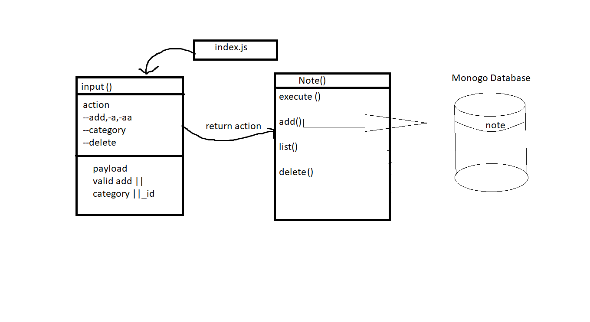

# LAB - 04

## Project: Notesy

### Author: Ahlam Alefishat

### Links and Resources

- [submission PR](https://github.com/AhlamAlefishat-401-advanced-javascript/notes/pull/6)

- [front-end application](https://notes-lab.herokuapp.com/)

#### How to initialize/run your application (where applicable)
-  ` node index.js --add (YOUR NOTE)`
-  ` node index.js --a (YOUR NOTE)`
-  ` node index.js -a (YOUR NOTE)`
- `node index.js -add (YOUR NOTE) --category 'classify your note'`
- `node index.js --a (YOUR NOTE) --category 'classify your note'`
- `node index.js -a (YOUR NOTE) --category 'classify your note'`
- `node index.js --list show all categories`
- `node index.js --list category name show all recored from a category`
- `node index.js --delete id delete item with that id`
#### Tests

- npm test
- npm run test

#### UML

